# Accelerating Envoy Contributions with AI-Powered Pre-Review

**Reducing PR friction and catching issues before they reach maintainers**

---

## The Challenge: Contributing to Large Open Source Projects

Contributing to [Envoy Proxy](https://www.envoyproxy.io/) is rewarding but challenging. As one of the most critical pieces of cloud-native infrastructure—powering service meshes at companies like Google, Lyft, and Salesforce—Envoy maintains exceptionally high code quality standards.

For contributors, this means navigating:

- **Strict formatting rules** across C++, Proto, Python, and Bazel files
- **Comprehensive testing requirements** with 100% coverage expectations
- **Complex CI pipelines** that can take 30+ minutes to complete
- **Detailed review processes** from expert maintainers with different focus areas
- **Documentation requirements** including changelogs and release notes

The result? A typical contribution cycle looks like this:


Each iteration through this loop costs hours of waiting time. What if we could catch most issues _before_ pushing?

---

## The Solution: Envoy PR Pre-Review Agent

I've developed an AI-powered code review agent that runs locally before you push your changes. Built on [Claude Code](https://claude.ai/code), it simulates the entire review process—from CI checks to maintainer feedback—in seconds to minutes instead of hours.

```mermaid
flowchart LR
    A[Write Code] --> B[Run Pre-Review<br/>2-5 min]
    B --> C{Issues Found?}
    C -->|Yes| A
    C -->|No| D[Push to GitHub]
    D --> E[CI Passes ✓]
    E --> F[Quick Review ✓]
    F --> G[Merged!]

    style B fill:#efe,stroke:#0a0
    style E fill:#efe,stroke:#0a0
    style F fill:#efe,stroke:#0a0
```



### How It Works

The agent orchestrates **14 specialized sub-agents**, each focused on a specific aspect of code quality:


---

## Key Features

### 1. Instant Feedback Without Docker

Nine sub-agents run without Docker, providing feedback in seconds:

| Sub-Agent              | What It Checks                            | Time   |
| ---------------------- | ----------------------------------------- | ------ |
| **PR Metadata**        | DCO sign-off, commit message format       | < 1s   |
| **Dev Environment**    | Git hooks, bootstrap setup                | < 1s   |
| **Inclusive Language** | Prohibited terms (whitelist→allowlist)    | < 1s   |
| **Docs & Changelog**   | Release notes for user-facing changes     | < 1s   |
| **Extension Policy**   | CODEOWNERS, security posture, status tags | < 1s   |
| **Test Coverage**      | Heuristic coverage estimation             | 1-5s   |
| **Code Expert**        | Memory safety, threading, Envoy patterns  | 5-30s  |
| **Security Audit**     | CVE detection via OSV/GitHub/NVD APIs     | 5-30s  |
| **Maintainer Review**  | Predicted reviewer comments               | 10-60s |

### 2. Maintainer Review Prediction

This is where AI shines. The agent simulates **five different reviewer personas**, each with distinct priorities:

| Persona             | Focus Area                             | Example Predictions                          |
| ------------------- | -------------------------------------- | -------------------------------------------- |
| 🎯 **Performance**  | Allocations, hot paths, latency        | "Consider `absl::string_view` to avoid copy" |
| 📐 **Style**        | Naming, const-correctness, formatting  | "Method should be marked `const`"            |
| 🔒 **Security**     | Validation, bounds checking, injection | "Add bounds check before buffer access"      |
| 🏗️ **Architecture** | Patterns, extensibility, guards        | "New behavior needs runtime guard"           |
| 🧪 **Testing**      | Coverage, edge cases, mocks            | "Missing test for error path"                |

Each prediction includes:

- **Exact file and line reference**
- **Predicted comment** (what the reviewer would say)
- **Rationale** (why this matters)
- **Suggested fix** (how to address it)

### 3. Review Readiness Score

Get a quantified assessment of your PR's readiness:

```
Review Readiness Score: 78/100

Breakdown:
- Errors found: 0 (-0 points)
- Warnings found: 3 (-15 points)
- Info items: 4 (-8 points)

Estimated review time: ~25 minutes
```

### 4. CI-Equivalent Docker Checks

When you need full verification, enable Docker-based checks that mirror Envoy's CI:

```bash
/envoy-review --build-dir=/path/to/envoy-build
```

This runs the same `clang-format`, `clang-tidy`, and test suites that CI uses—but locally, where you can iterate faster.

---

## Usage

### Installation

```bash
# Clone the agent repository
git clone https://github.com/your-org/envoy-review-agent.git

# Copy to your Envoy working directory
cp -r envoy-review-agent/.claude /path/to/your/envoy-repo/
```

### Running the Agent

```bash
# Start Claude Code in your Envoy repo
cd /path/to/your/envoy-repo
claude

# Run fast checks (no Docker)
> /envoy-review --skip-docker

# Run full checks with Docker
> /envoy-review --build-dir=/path/to/build

# Run specific checks only
> /envoy-review --only=pr-metadata,maintainer-review,code-expert
```

### Example Output

```
════════════════════════════════════════════════════════════════
                 ENVOY PR PRE-REVIEW REPORT
════════════════════════════════════════════════════════════════

Branch: feature/add-http-filter
Base: main
Commits: 2

## Executive Summary

| Category          | Errors | Warnings | Info |
|-------------------|:------:|:--------:|:----:|
| PR Metadata       |   0    |    1     |  0   |
| Docs/Changelog    |   0    |    1     |  0   |
| Code Expert       |   0    |    2     |  1   |
| Maintainer Review |   0    |    6     |  3   |
| **TOTAL**         | **0**  |  **10**  |**4** |

**Status**: 🟡 NEEDS_WORK
**Review Readiness Score**: 72/100
**Estimated Review Time**: ~35 minutes

## 👥 Predicted Reviewer Comments

### 🎯 Performance-Focused (2 comments)
| File:Line | Comment | Suggestion |
|-----------|---------|------------|
| filter.cc:45 | String copy in hot path | Use `absl::string_view` |
| filter.cc:89 | Allocation per request | Consider object pool |

### 🧪 Testing-Focused (2 comments)
| File:Line | Comment | Suggestion |
|-----------|---------|------------|
| filter.cc:45-120 | New class needs tests | Create filter_test.cc |
| filter.h:30 | Edge case not covered | Test empty input handling |

## Next Steps

1. [ ] Fix commit message format (lowercase subsystem)
2. [ ] Add release notes in changelogs/current.yaml
3. [ ] Consider performance suggestions for hot path
4. [ ] Add unit tests for new functionality

════════════════════════════════════════════════════════════════
```

---

## Workflow Integration

### For PR Authors

The agent transforms the contribution workflow from reactive to proactive:

```mermaid
flowchart TB
    subgraph "Traditional Workflow"
        T1[Code] --> T2[Push]
        T2 --> T3[CI Fails]
        T3 --> T4[Fix & Push]
        T4 --> T5[CI Passes]
        T5 --> T6[Review Comments]
        T6 --> T7[Fix & Push]
        T7 --> T8[More Comments]
        T8 --> T9[Finally Approved]
    end

    subgraph "With Pre-Review Agent"
        A1[Code] --> A2[Pre-Review]
        A2 --> A3[Fix Issues]
        A3 --> A2
        A2 --> A4[Push]
        A4 --> A5[CI Passes ✓]
        A5 --> A6[Quick Approval ✓]
    end

    style T3 fill:#fee
    style T6 fill:#fee
    style T8 fill:#fee
    style A5 fill:#efe
    style A6 fill:#efe
```



**Benefits for authors:**

- Catch formatting issues before CI runs
- Get instant feedback on code quality
- Anticipate reviewer concerns before they're raised
- Reduce round-trips with maintainers
- Learn Envoy conventions through concrete suggestions

### For PR Reviewers

The agent also benefits maintainers reviewing PRs:

**If the author used the agent:**

- PR arrives in better shape
- Common issues already addressed
- Review focuses on design, not style
- Faster path to approval

**Reviewers can also run the agent themselves:**

```bash
# Check out the PR branch
git fetch origin pull/12345/head:pr-12345
git checkout pr-12345

# Run pre-review analysis
/envoy-review --skip-docker
```

This provides a structured checklist of potential issues to investigate.

---

## Technical Implementation

The agent is built as a [Claude Code slash command](https://docs.anthropic.com/claude-code) with a modular sub-agent architecture:

```
.claude/
├── commands/
│   └── envoy-review.md      # Main orchestrator
└── agents/
    ├── pr-metadata.md       # Commit/PR checks
    ├── dev-env.md           # Environment validation
    ├── code-lint.md         # Static analysis
    ├── code-expert.md       # C++ expert analysis
    ├── code-format.md       # Formatting (Docker)
    ├── security-audit.md    # CVE detection
    ├── test-coverage.md     # Coverage analysis
    ├── unit-tests.md        # Test execution (Docker)
    ├── docs-changelog.md    # Documentation checks
    ├── api-review.md        # API compatibility (Docker)
    ├── deps-check.md        # Dependency validation (Docker)
    ├── extension-review.md  # Extension policy
    ├── maintainer-review.md # Reviewer simulation
    └── report-generator.md  # Final report
```

Each sub-agent is a markdown file containing:

- Activation conditions (when to run)
- Execution steps (what to check)
- Output format (structured findings)
- Docker requirements (if any)

This modular design makes it easy to:

- Add new checks
- Customize existing ones
- Enable/disable specific checks via flags

---

## Results and Impact

### Time Savings

| Scenario             | Without Agent         | With Agent | Savings |
| -------------------- | --------------------- | ---------- | ------- |
| Format issues caught | 30+ min (CI)          | 2-5 min    | 85%+    |
| Missing DCO sign-off | 30+ min (CI)          | < 1 sec    | 99%+    |
| Review round-trips   | 1-3 days × 2-3 cycles | 1 cycle    | 50-70%  |

### Quality Improvements

- **Fewer CI failures**: Issues caught locally before push
- **Better first impressions**: PRs arrive in review-ready state
- **Faster learning curve**: New contributors get immediate, Envoy-specific guidance
- **Consistent quality**: All contributors benefit from expert-level review patterns

---

## Where to Find It

The Envoy PR Pre-Review Agent is available at:

📦 **Repository**: [github.com/your-org/envoy-review-agent](https://github.com/your-org/envoy-review-agent)

📖 **Documentation**: See README.md in the repository

🚀 **Quick Start**:

```bash
git clone https://github.com/your-org/envoy-review-agent.git
cp -r envoy-review-agent/.claude /path/to/envoy/
cd /path/to/envoy && claude
> /envoy-review --skip-docker
```

---

## Future Directions

Potential enhancements include:

1. **GitHub Action Integration**: Run the agent automatically on PR creation
2. **Learning from Reviews**: Train on actual maintainer comments to improve predictions
3. **Custom Rule Sets**: Allow teams to add project-specific checks
4. **IDE Integration**: Real-time feedback while coding

---

## Conclusion

The Envoy PR Pre-Review Agent demonstrates how AI can meaningfully improve developer workflows—not by replacing human judgment, but by augmenting it. By catching routine issues early and predicting reviewer concerns, it lets both contributors and maintainers focus on what matters: building great software.

The best code review is the one that happens before submission.

---

_Built with [Claude Code](https://claude.ai/code) by [Your Name] as part of Q4 objectives._
